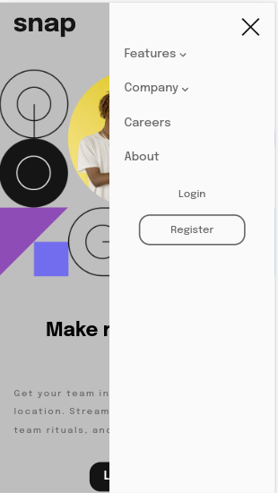
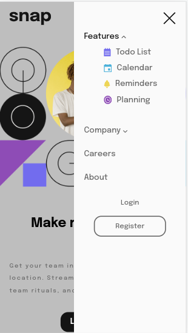

# Frontend Mentor - Intro section with dropdown navigation solution

This is a solution to the [Intro section with dropdown navigation challenge on Frontend Mentor](https://www.frontendmentor.io/challenges/intro-section-with-dropdown-navigation-ryaPetHE5). Frontend Mentor challenges help you improve your coding skills by building realistic projects. 

## Table of contents

- [Overview](#overview)
  - [The challenge](#the-challenge)
  - [Screenshot](#screenshot)
  - [Links](#links)
- [My process](#my-process)
  - [Built with](#built-with)
  - [What I learned](#what-i-learned)
- [Author](#author)

**Note: Delete this note and update the table of contents based on what sections you keep.**

## Overview

### The challenge

Users should be able to:

- View the relevant dropdown menus on desktop and mobile when interacting with the navigation links
- View the optimal layout for the content depending on their device's screen size
- See hover states for all interactive elements on the page

### Screenshot

### Links

- Solution URL: [github](https://github.com/bipurna/mentor-io-dropdown)
- Live Site URL: [dropdown-challange-live-server](https://bipurna.github.io/mentor-io-dropdown/)

### Built with

- Semantic HTML5 markup
- CSS custom properties
- Flexbox
- javascript

### What I learned
- I could learn more about flex-box

### Useful resources

- [Mozila Devloper](https://developer.mozilla.org/en-US/) - This site help me to find out the most of usecase of tags and attributes.
## Author

- Website - [Tara KumarSunuwar](https://www.tarakumarsunuwar.com.np)
- Frontend Mentor - [@bipurna](https://www.frontendmentor.io/profile/bipurna)
- Twitter - [@bipurna_](https://www.twitter.com/bipurna_)

